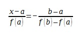

# Métodos Numéricos 

## Proyecto #2: Documento Explicativo + Capturas de pantalla

### Integrantes:
* Campos Granados María José :grin:
* Ramírez Ochoa Fernanda Monserrat :octocat:
* Rocha Avila Emmanuel :neckbeard:

**Carrera:** Ingeniería en Sistemas Computacionales

**Profesor:** Dr. Zamudio Rodríguez Víctor Manuel

**Fecha de entrega de CD:** 11 de Abril de 2018

## A. Método Bisección.

*(También conocido como: "de corte binario", "de partición de 
intervalos" o "de Bolzano")*

El signo de f(x) cambia a ambos lados de la raíz. Si f(x) es real y continúa en el intervalo que va desde Xl hasta Xu y f(Xl) y f(Xu) tienen signos opuestos, es decir,

entonces hay al menos una raíz real entre xl y xu.

Los métodos de búsqueda incremental aprovechan esta  característica localizando un intervalo en el que la función cambie de signo. Entonces, la localización del cambio de signo (y, en consecuencia, de la raíz) se logra con más exactitud al dividir el intervalo en varios subintervalos.

Se investiga cada uno de estos subintervalos para encontrar el cambio de signo. El proceso se repite y la aproximación a la raíz mejora cada vez más en la medida que los subintervalos se dividen en intervalos cada vez más pequeños.

Es un tipo de búsqueda incremental en el que el intervalo se 
divide siempre a la mitad. Si la función cambia de signo sobre un intervalo, se evalúa el valor de la función en el punto medio. La posición de la raíz se determina situándola en el punto medio del subintervalo, dentro del cual ocurre un cambio de signo. El proceso se repite hasta obtener una mejor aproximación.

**Algoritmo de bisección**

## B. Método de la Secante.

 
    Un problema potencial en la implementación del método de Newton-Raphson es la evaluación de la derivada. Existen algunas funciones cuyas derivadas en ocasiones resultan muy difíciles de calcular. En dichos casos, la derivada se puede aproximar mediante una diferencia finita dividida hacia atrás, como en: 

y al sustituirlo en la ecuación:

se obtiene la expresión:

Algoritmo:

1. Tome “ i = 2 ” 
2. Mientras “ i ≤ No ” haga 3 – 6
3. 
4. Si “ fp = 0 ” ó fp < TOL entonces salida P (Exit) stop.
5. i = i + 1
6. 
7. Salida: el método fracasó después de “ No ” iteraciones.

Ejemplo de aplicación del método:

## C. Método de Newton-Raphson.

    En cálculo diferencial, se conoce como el método de Newton-Raphson a la función iterativa desarrollada por Isaac Newton para aproximar los ceros de una función cualquiera, valiéndose solamente de la función misma y su derivada.

 

    El proceso iterativo es bastante útil para encontrar, por ejemplo, las raíces de una función cúbica con ceros no necesariamente enteros o racionales (irracionales, no complejos) los cuales serían difíciles de encontrar con los métodos tradicionales como la factorización.

 

    Dado un valor inicial x, que idealmente podría ser un valor cercano a la raíz, evaluamos la función en dicho valor, luego encontramos la ecuación de la recta tangente a la función en ese punto, encontramos luego su respectivo intercepto con el eje x. 

    Ese numero se toma como valor siguiente y se vuelve a hacer el proceso. Eventualmente llegaremos a la raíz con una buena aproximación decimal, mientras más iteraciones se hacen, más preciso es el resultado.

#### Geométricamente se ve así:

##### Ejemplo de aplicación del método:

**Planteamiento del problema:** Utilice el método de Newtón- Raphson para calcular la raíz de f(x)= e^-x -1 empleando como valor inicial  Xo = 0 . 

**Solución:** La primera derivada de la función es f´(x)= -e^-x -1 que se sustituye junto con la función original en la ecuación para tener:

Empezando con un valor inicial Xo=0, se aplica está ecuación iterativa para calcular.

 Así el método converge rápidamente a
 la raíz verdadera. Observe el que error
 relativo porcentual verdadero en cada
 iteración disminuye mucho más rápido
 con la iteración simple de punto fijo 

1. Escoger un valor inicial (Xi).
2. La primera aproximación de la raíz es el valor (Xr) para el que la recta tangente a la función f(x) en el punto (Xi, f(Xi)) cruza el eje de las “x”.
4. Calcular una nueva aproximación a la raíz
5. Verificar si la nueva aproximación es tan exacta como se desea.

*Si es así los cálculos terminan / De otro modo regrese al paso 3.*

## D. Método de la Regla falsa.

*(También llamado “Método de Falsa Posición”, “Método Regula-Falsi” y “Método de Interpolación Lineal”)*

    Pertenece a los métodos que utilizan intervalos, es un método que aprovecha una visualización gráfica que consiste en unir f(a) y f(b) con una línea recta. La intersección de esta línea con el eje de las x representa una mejor aproximación de la raíz (siguiente b ó a). El hecho de que se reemplace la curva por una línea recta da una “falsa posición” de la raíz; de aquí el nombre de método de la falsa posición, o en latín, “regula falsi”.

Usando triángulos semejantes, la intersección de la línea recta con el eje de las x se estima mediante:

en la que se despeja “x”:

En esta expresión aparece la relación:

que es equivalente al inverso de la derivada de primer orden de la función:

La ecuación resultante es: 

    La velocidad de convergencia de este método es muy superior a la del método de la bisección cuando ambos puntos están lejos de la solución. Sin embargo su eficiencia ya no es tan evidente cuando un punto esta distante de la solución y el otro esta muy cercano a ella. 

Algoritmo:

1. Toma “ i = 0 ”
2. Mientras “ i ≤ No ” haga 3 a 6.
3. Se asignan:
 * fa = f(a)
 * fb = f(b)
 * 
 * fp = f(p)
4. Si  entonces salida P (Raiz) (Exit) stop
5. i = i + 1
6. Si 
7. El método fracaso después de “ No ” iteraciones

Ejemplo de aplicación:

## E. Anexo - Capturas de pantalla

*Menú principal de la aplicación*

*Métodos de la unidad 2 (Proyecto Actual)*

*Unidad 1 (Proyecto Anterior)*

*Introducimos los parámetros*

*Al oprimir "BISECCIÓN" se muestra el resultado.*

*En la consola se ve la tabla resultante (Explicación vocal pendiente)*

*En la consola se ve la tabla resultante (Explicación vocal pendiente)*

*Al oprimir "SECANTE" se muestra el resultado.*

*En la consola se ve la tabla resultante (Explicación vocal pendiente)*

